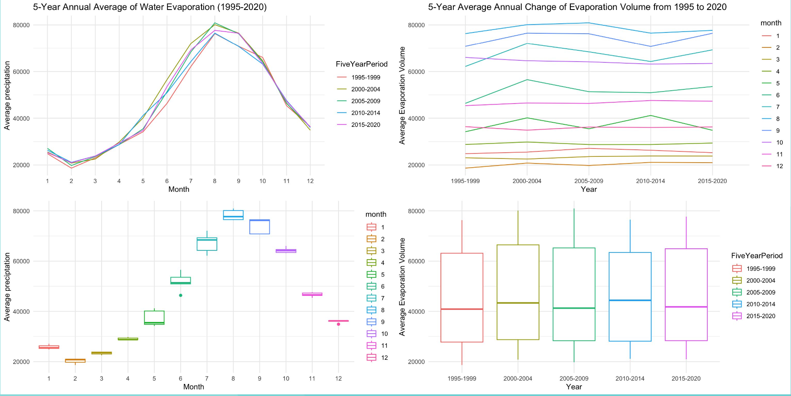
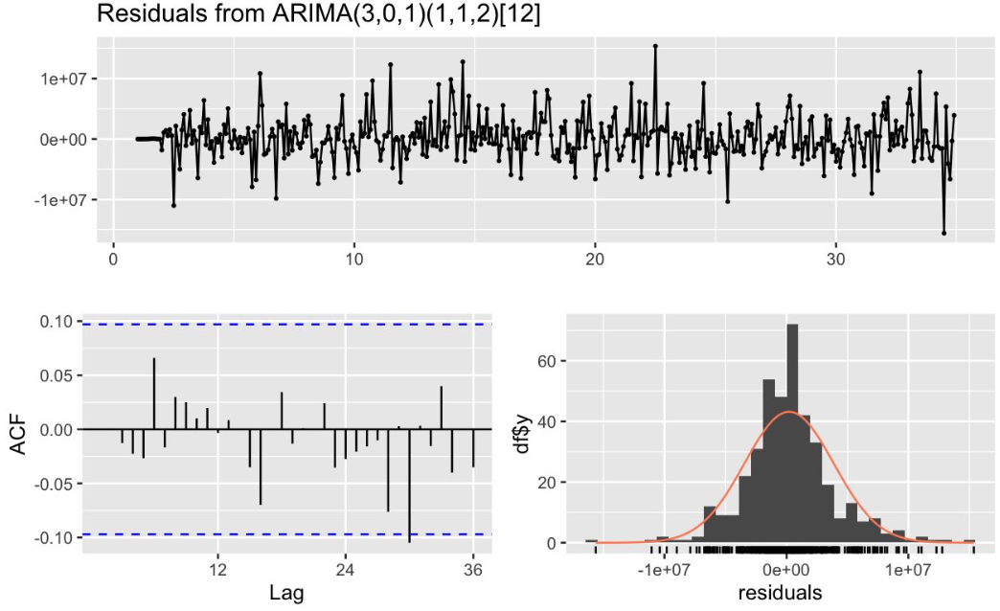
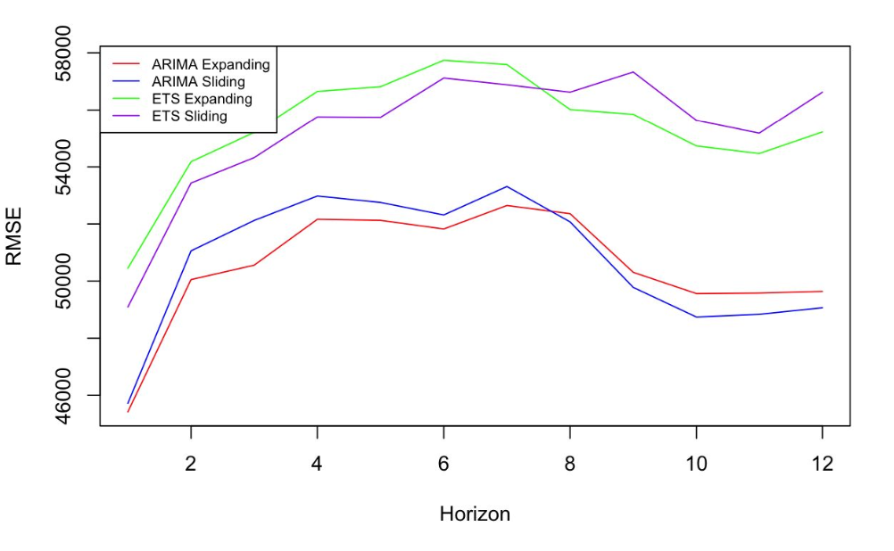
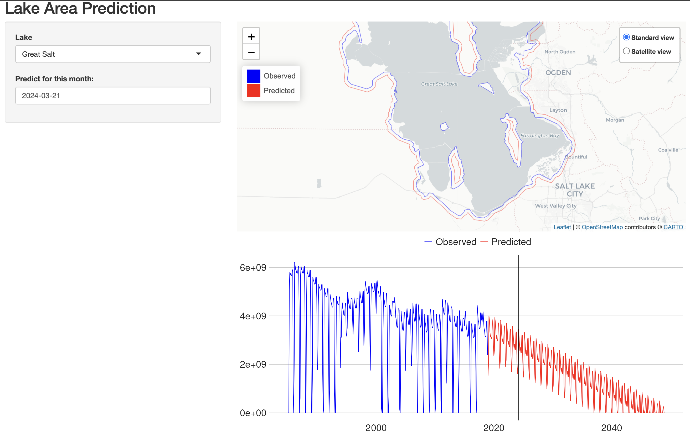

# Lake Evaporation Dynamics Analysis

## Collaborators

Grey Xu,
Setu Loomba,
Ethan Arsht

## Project Overview

This project explores the dynamics of weather, lake evaporation and its implications on water bodies, particularly focusing on the effects of weather variables. We utilize the processed Global Lake Evaporation (GLEV) dataset to uncover various aspects including lake open areas, evaporation rates, and weather data to understand and predict the behavior of lake water bodies under different environmental conditions.

## Dataset

The [GLEV dataset](https://zeternity.users.earthengine.app/view/glev) comprises monthly data capturing the surface areas and evaporation rates from 1.42 million lakes, including the weather data from the National Center of Environmental Information (NCEI). 

## Key Findings

- **Case Study on Lake Tahoe:** We performed an extendive analysis of Lake Tahoe revealed significant seasonal patterns in water evaporation rates and temperature, with a notable correlation between temperature and water evaporation volume (0.846055).

- **Predictive Modeling:** The ARIMAX model, incorporating temperature and precipitation as regressors, emerged as the best model for predicting water evaporation rates, showcasing the complex interplay between weather variables and evaporation.

- **Water Body Loss and Evaporation:** We also performed a broad analysis and identified a general model across 100 lakes in the U.S. to identify general patterns in lake size changes and evaporation rates. We also employed cross validation for different models for both sliding and expanding windows to identify the most accurate and consistent approach. ARIMA performed better in both sliding and expanding windows.

- **Lake Classification:** We employed hierarchical clustering to classify lakes globally, offering insights into the diverse behaviors and characteristics of lakes under varying climatic conditions.

## Web Application

A web application is developed to facilitate the prediction of lake water bodies into the future, accessible at: [Lake Predictor](https://ethanapps.shinyapps.io/lake_predictor/). This tool leverages the best predictive models to offer users actionable insights into lake evaporation dynamics.

